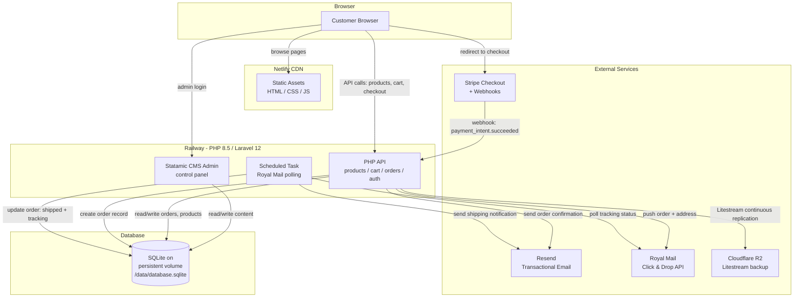

# Phase 2 - Architecture Plan

Date: 2026-03-31

---

## 1. CMS Recommendation

### Comparison table

| Criteria | Statamic Core (free) | Filament v5 + EditorJS | Bespoke PHP + EditorJS |
|---|---|---|---|
| Block UX | Excellent - Bard fieldtype with drag-reorder, inline sets, live preview | Good - EditorJS plugin functional but feels like a form field, not a page builder | Poor - no admin UI, must build everything |
| PHP 8.5 compat | Yes - Statamic 6 on Laravel 12 | Yes - Filament v5 on Laravel 12 | Yes - plain PHP |
| Total cost | GBP 0 (Core: 1 admin, 1 form) | GBP 0 (MIT) | GBP 0 (high dev-time cost) |
| Owner usability | High - purpose-built CMS control panel, non-developer friendly | Medium - admin panel framework, not a CMS; requires custom content UX | Low - no UI exists |
| Cart complexity | Simple Commerce addon (free) or direct Stripe Checkout integration | Must build from scratch | Must build from scratch |

### Decision: Statamic Core (free tier)

Justification:
- Owner is a non-developer - Statamic is the only candidate with a production-ready CMS control panel out of the box
- Bard block editor satisfies the "block-based CMS" requirement without custom development
- Core free tier includes 1 admin user (requirements explicitly exclude multiple admin users in v1) and 1 form (sufficient for the contact form)
- Flat-file content storage means CMS content is git-versioned by default; order/customer data goes to SQLite via Eloquent Driver
- E-commerce via direct Stripe Checkout integration (simpler than Simple Commerce addon for the cart-to-checkout flow required)
- Use Blade templates (not Antlers) to reduce lock-in

---

## 2. PHP Hosting Decision

### Decision: Railway Hobby plan (USD 5/mo - GBP 4/mo)

| Criteria | Detail |
|---|---|
| Monthly cost | USD 5/mo (includes USD 5 usage credits); 0.5GB RAM + 1GB volume stays within credits |
| Git-push auto-deploy | Yes - GitHub integration, automatic deploys on push to main |
| Cold start behaviour | None if always-on. Sleep-after-10min mode adds 2-5s wake - recommend always-on for API serving live frontend |
| SQLite file persistence | **Confirmed: Railway volumes survive redeploys.** Mount at `/data`, store `.sqlite` files there. Hobby plan includes up to 5GB. This is a first-class, well-documented feature. |

### Persistent storage - critical check

**Status: CONFIRMED SAFE.** Railway persistent volumes survive redeploys, restarts, and container replacements. The SQLite database at `/data/database.sqlite` will persist. No need to switch to Postgres for persistence reasons.

Additional safeguard: Litestream continuous replication to Cloudflare R2 (free tier: 10GB storage, no egress fees) provides near-zero RPO backup. Railway automatic volume snapshots provide daily backup as a second layer.

**Decision: SQLite confirmed. Postgres not required.**

---

## 3. Full Stack Confirmation

| Layer | Decision | Justification |
|---|---|---|
| Frontend | Static HTML/CSS/JS on Netlify (free tier) | CDN-delivered, fast loads, GBP 0/mo. Build step generates static pages from CMS content via Statamic SSG or API fetch at build time. |
| Backend | PHP 8.5 on Railway (Laravel 12) | Statamic 6 runs on Laravel 12. Railway provides git-push deploy, persistent volumes, env var management. |
| CMS | Statamic Core (free) with Bard block editor | Non-developer owner can manage all content and products. Blade templates to reduce lock-in. |
| Database | SQLite (WAL mode) on Railway persistent volume | 10-20 SKUs, 1-20 orders/day - well within SQLite comfort zone. Litestream backup to Cloudflare R2. |
| Payments | Stripe Checkout (redirect flow) | Multi-product cart built in frontend JS, then redirect to Stripe Checkout session created by PHP API. Stripe handles PCI compliance. Webhook confirms payment. |
| Email | Resend (transactional) | Order confirmation + shipping notification with tracking. Free tier: 3,000 emails/mo (sufficient for this scale). Laravel mail driver available. |
| Design tooling | frontend-design skill + ui-ux-pro-max skill | frontend-design for production-grade component generation. ui-ux-pro-max for palette, typography, and UX pattern selection aligned to brand (greens + warm golds). |
| Shipping | Royal Mail Click & Drop API | Orders push automatically after Stripe payment confirmed. Tracking number feeds back via polling (Click & Drop has no webhook - must poll). Tracking update triggers shipping notification email via Resend. |

---

## 4. Architecture Diagram

---

## 5. Decision Log

| Decision | Chosen | Alternatives considered | Reason |
|---|---|---|---|
| CMS | Statamic Core (free) | Filament + EditorJS, Bespoke PHP + EditorJS | Only option with production-ready admin panel for non-developer owner. GBP 0. Bard block editor matches requirements. |
| PHP host | Railway Hobby (USD 5/mo) | Fly.io (USD 3/mo), Render (USD 7/mo), Shared cPanel (GBP 1-3/mo) | Best balance of cost, DX, git-push deploy, and persistent volume support. Fly.io cheaper but steeper learning curve. |
| Database | SQLite (WAL mode) | Postgres on Railway/Neon | 10-20 SKUs, 1-20 orders/day is well within SQLite limits. Persistent volume confirmed. Simpler ops, no separate DB service cost. |
| Database backup | Litestream to Cloudflare R2 | Cron + .backup to S3, Railway snapshots only | Near-zero RPO. R2 free tier sufficient. Railway snapshots as second layer. |
| Payments | Stripe Checkout (redirect) | Stripe Elements (embedded), Simple Commerce addon | Redirect flow offloads PCI scope entirely. Simpler than embedded. Simple Commerce adds unnecessary abstraction for this cart size. |
| Email | Resend | Postmark, SendGrid, Mailgun | Laravel driver available. Free tier (3,000/mo) sufficient. Simple API. Good deliverability. |
| Shipping | Royal Mail Click & Drop API | Manual label printing, ShipStation | Requirements specify Click & Drop. Direct API integration avoids third-party middleware cost. |
| Frontend hosting | Netlify (free tier) | Vercel, Cloudflare Pages | Netlify free tier sufficient. Good DX, automatic deploys, CDN. |
| Template engine | Blade (not Antlers) | Antlers (Statamic default) | Reduces Statamic lock-in. Blade is standard Laravel - portable if CMS changes. |
| Content storage | Flat files (git) for CMS content; SQLite for orders/customers | All in SQLite via Eloquent Driver | CMS content in git = version controlled, backed up by default. SQLite reserved for transactional data (orders, customers). |
| Royal Mail tracking | Scheduled polling (cron) | Webhook | Click & Drop API does not provide webhooks for tracking updates. Must poll. 15-minute cron interval is sufficient for shipping updates. |

---

## 6. Risk Register

| Risk | Likelihood | Impact | Mitigation |
|---|---|---|---|
| SQLite on ephemeral filesystem (data loss on redeploy) | **Eliminated** | Critical | Railway persistent volume confirmed. SQLite stored at `/data/database.sqlite` on mounted volume. Litestream replication to R2 as backup. |
| SQLite write concurrency under load | Very Low | Medium | WAL mode enabled. At 1-20 orders/day, concurrent writes are rare. Busy timeout set to 5000ms. Switch-to-Postgres triggers documented (any 2 of: >10 concurrent writes, >2GB DB, multi-server needed). |
| Cold starts on Railway | Low | Low | Use always-on mode (not sleep-after-10min). Cost stays within USD 5/mo credits for a small PHP app. If sleep mode is used, 2-5s wake time - acceptable for non-critical first request. |
| CMS lock-in (Statamic) | Medium | Medium | Use Blade templates (not Antlers) to keep views portable. CMS content is flat-file YAML/Markdown - exportable. Order data is in standard SQLite/Laravel schema. Migration to raw Laravel is feasible. |
| Stripe webhook reliability | Low | High | Implement idempotency keys on webhook handler. Verify webhook signatures. Add a cron job to reconcile unpaid orders against Stripe API (catch missed webhooks). Stripe retries failed webhooks for up to 3 days. |
| Owner self-sufficiency post-handoff | Medium | High | Statamic's CMS panel is designed for non-developers. Provide a written runbook covering: adding products, editing pages, viewing orders, common troubleshooting. Limit custom code to well-documented patterns. |
| Royal Mail Click & Drop API reliability / rate limits | Medium | Medium | Implement retry with exponential backoff on API failures. Queue failed order pushes for retry. Rate limits are generous for low-volume use (documented at 100 requests/min). Log all API interactions for debugging. |
| Royal Mail Click & Drop API deprecation risk | Low | High | Click & Drop is Royal Mail's primary integration for small businesses (active as of 2026). Monitor Royal Mail developer communications. If deprecated, Royal Mail Shipping API v3 is the successor - similar REST interface, migration is straightforward. |
| Litestream replication failure (silent) | Low | High | Monitor Litestream process health via Railway health checks. Alert on replication lag. Test restore procedure quarterly. Railway volume snapshots provide fallback if Litestream fails. |
| Netlify free tier limits exceeded | Very Low | Low | Free tier: 100GB bandwidth/mo, 300 build minutes/mo. A small e-commerce static site will not approach these limits. Monitor usage. Upgrade to Pro (USD 19/mo) if needed - still within GBP 20 budget. |
| SQLite WAL-reset bug (pre-3.52.0) | Low | Critical | Ensure Railway Docker image includes SQLite 3.52.0+ (fixed March 2026). Pin version in Dockerfile. Test on deploy. |
